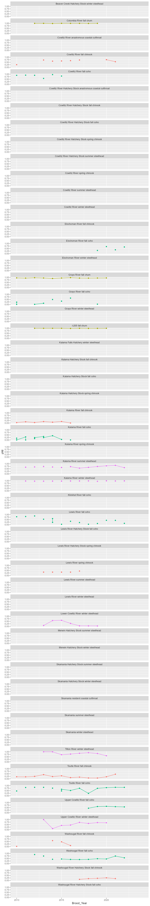

```{=html}
<script>
   $(document).ready(function() {
     $head = $('#header');
     $head.prepend('')
   });
</script>
```

```{r setup, include=FALSE}
knitr::opts_chunk$set(echo = TRUE)
pacman ::p_load(jsonlite, dplyr, RODBC, curl,odbc,DBI,tidyverse,janitor,fuzzyjoin,ggplot2,lubridate,kableExtra,sf,rnaturalearth,ggmap,httr)
#define sql query function:
SQL_query<- function(dsn,SQL){
  con <- odbcConnect(dsn)
  results <- RODBC::sqlQuery(con, as.is = TRUE,SQL)
  close(con)
  return(results)
} 
#define function to join release locations to closest NOAA pop polygon and calculate distance.
st_join_min<-function(x,y){
  d<-st_distance(x,y)
  NWFSC_POP_ID<-y$NWFSC_POP_ID[apply(d,1,which.min)]
  distance=apply(d,1,min)
  results<-data.frame(x,"NWFSC_POP_ID"=NWFSC_POP_ID,"distance"=distance)
  return(results)
}
```

## Query SPI to get LCR pop list
```{r results='hide',warning=FALSE,message=FALSE}
database_args<-list(
  Driver = "PostgreSQL Unicode",
  Server = Sys.getenv("POSTGRES_SPI_IP"),
  Database = "FISH",
  Port = 5433,
  UID = Sys.getenv("POSTGRES_SPI_UN"),
  PWD = Sys.getenv("POSTGRES_SPI_PW"),
  Trusted_Connection = "True"
)
  
con <- DBI::dbConnect(
  odbc::odbc(),
  Driver = database_args$Driver,
  Server = database_args$Server,
  Database = database_args$Database,
  Port = database_args$Port,
  UID = database_args$UID,
  PWD = database_args$PWD,
  Trusted_Connection = database_args$Trusted_Connection
)

species_lut<-data.frame(DBI::dbGetQuery(con, "SELECT * FROM spi.species_lut;"))%>%
  dplyr::select(sasi_common_name,species_lut_id)

sasi_run_lut<-data.frame(DBI::dbGetQuery(con, "SELECT * FROM spi.sasi_run_lut;"))%>%
  dplyr::select(sasi_run_lut_id,sasi_run_desc)

nosa<-data.frame(DBI::dbGetQuery(con, "SELECT * FROM spi.vw_ca_nosa_sos2;"))

stock<- data.frame(DBI::dbGetQuery(con, "SELECT * FROM spi.stock;"))%>%
  filter(nosa_esu_dps_name%in%c("Salmon, coho (Lower Columbia River ESU)",
                                "Steelhead (Lower Columbia River DPS)",
                                "Salmon, Chinook (Lower Columbia River ESU)",
                                "Salmon, chum (Columbia River ESU)"
                                ) | stock_name %in%c("Mill-Abernathy-Germany Creeks Winter Steelhead","Grays-Chinook Winter Steelhead","Elochoman-Skamokawa Winter Steelhead","Klickitat Summer and Winter Steelhead")
         )%>%
  left_join(species_lut)%>%
  left_join(sasi_run_lut)%>%
  # bind_rows(
  #   tibble(
  #     "sasi_stock_num" = "9999",                    
  #     "stock_name" = "Salmon Creek Winter Steelhead",            
  #     "nosa_common_pop_name" = "Salmon Creek Winter Steelhead",
  #     "nosa_esu_dps_name" = "Steelhead (Lower Columbia River DPS)",                
  #     "nosa_esa_pop_name" = "Steelhead (Lower Columbia River DPS) Salmon Creek - winter",   
  #     "sasi_run_desc" = "Winter",
  #     "sasi_common_name" = "Steelhead"
  #   )
  # )%>%
  mutate(location=gsub("Coho","",nosa_common_pop_name),
         location=gsub("Steelhead","",location),
         location=gsub("Chum","",location),
         location=gsub("Chinook","",location),
         location=gsub("Winter","",location),
         location=gsub("Spring","",location),
         location=gsub("Summer","",location),
         location=gsub("Fall","",location),
         location=gsub("Late","",location),
         location=gsub("Early","",location),
         location=gsub("(Bright)","",location),
         location=gsub("(Tule)","",location),
         location=gsub("  ","",location),
         location=str_replace_all(location, "[[:space:]\\p{P}]+", " "),
         nosa_esa_pop_name = ifelse(nosa_esa_pop_name=="Salmon, coho (Lower Columbia River ESU) Washington Upper Gorge Tributaries and White Salmon River - ","Salmon, coho (Lower Columbia River ESU) Washington Upper Gorge Tributaries and White Salmon River - late",nosa_esa_pop_name),
         nosa_esa_pop_name = ifelse(stock_name=="Mill-Abernathy-Germany Creeks Winter Steelhead", "Steelhead (Southwest Washington DPS) Mill Creek - winter",nosa_esa_pop_name),
         nosa_esa_pop_name = ifelse(stock_name=="Grays-Chinook Winter Steelhead", "Steelhead (Southwest Washington DPS) Grays and Chinook Rivers - winter",nosa_esa_pop_name),
         nosa_esa_pop_name = ifelse(stock_name=="Elochoman-Skamokawa Winter Steelhead", "Steelhead (Southwest Washington DPS) Elochoman River - winter",nosa_esa_pop_name),
         nosa_esa_pop_name = ifelse(nosa_esa_pop_name=="Upper Cowlitz and Cispus Winter Steelhead Steelhead (Lower Columbia River DPS)", "Steelhead (Lower Columbia River DPS) Upper Cowlitz River - winter",nosa_esa_pop_name),
         
  )%>%
  #dplyr::select(nosa_common_pop_name,nosa_esa_pop_name)%>%
  filter(!is.na(nosa_esa_pop_name))%>%
  dplyr::rename(stock = location,
                run= sasi_run_desc
                )%>%
  mutate(species=str_replace_all(sasi_common_name, " ", ""),
         facility_name = stock,
         species=gsub("salmon","",species),
         run=ifelse(run%in%c("Late","Both early & late","Early","Early (Type S)","Late (Type N)"),"Fall",run)
         )%>%
  mutate(across(c(species,run,stock,facility_name),~tolower(.)))


DBI::dbDisconnect(con)
```

## Query FishBooks to identify unique Hatchery Spawn Groups (basically unique brood_codes without year). Generates table of hatchery spawn groups (combo of stock, facility, run, species, mark).
```{r results='hide',warning=FALSE,message=FALSE}
hatchery_spawn_groups<-SQL_query(dsn="busprod_hatcheries",SQL=
  "
  SELECT distinct	
  	facility.name as facility_name
    ,dfwf.Latitude_Meas as latitude	
  	,dfwf.Longitude_Meas as longitude
  	,event.event_type_id
  	,event_type_lut.description	
  	,SPECIES_LUT.Description as species_description
  	,run_lut.Description as run_description
  	,STOCK_LUT.Description as stock_description
  	,origin_lut.Description Origin_desc
  	,MARK_TYPE_CLIP_LUT.Description mark_type
    FROM hatcheries.dbo.EVENT_ADULT	
    JOIN hatcheries.dbo.event ON event.event_id = event_adult.event_id	
    JOIN hatcheries.dbo.brood ON event.brood_id = brood.brood_id	
    JOIN hatcheries.dbo.facility ON facility.facility_id = event.facility_id	
    JOIN hatcheries.dbo.event_type_lut ON event_type_lut.event_type_id = event.event_type_id		
    join hatcheries.dbo.STOCK_LUT on STOCK_LUT.STOCK_Id = brood.stock_id
    join hatcheries.dbo.RUN_LUT on run_lut.RUN_Id = brood.run_id	
    join hatcheries.dbo.SPECIES_LUT on SPECIES_LUT.SPECIES_Id = brood.species_id	
    join hatcheries.dbo.ORIGIN_LUT on origin_lut.ORIGIN_Id = BROOD.ORIGIN_Id	
    join hatcheries.dbo.MARK_TYPE_CLIP_LUT on MARK_TYPE_CLIP_LUT.MARK_TYPE_CLIP_Id = EVENT_ADULT.MARK_TYPE_CLIP1_ID	
    join fishProgram.WALOCs.facility waf on waf.facility_id = EVENT.facility_id	
    join fishProgram.WALOCs.vw_WALOCS_DFW_Facility dfwf on dfwf.WALOC_Id = waf.WALOC_Id	
    where name not like 'OLY%'	
    and brood_year >= 2010	
    and dfwf.Hatchery_Region_Group like '%Columbia%'	
    and dfwf.Region = 5	
  	and (event_adult.male_num > 0 OR event_adult.female_num > 0 OR event_adult.adult_num > 0 OR event_adult.jack_num > 0 OR event_adult.nvf_num > 0) AND event.deleted_flag = 'false' AND (event.event_type_id in (3))
    group by facility.name	
    ,dfwf.Latitude_Meas 	
  	,dfwf.Longitude_Meas 
  	,event.event_type_id
    ,event_type_lut.description	
  	,SPECIES_LUT.Description 
  	,run_lut.Description 
  	,STOCK_LUT.Description 
  	,origin_lut.Description 
  	,Wire_Collected_flag
  	,MARK_TYPE_CLIP_LUT.Description 
  "
)%>%#hatchery_spawn_groups<-readxl::read_excel("data/LCR_Hatchery_Spawns.xlsx")%>%
  filter(mark_type=="Unmarked",species_description!="CUTTHROAT")%>%
  mutate(run_description=ifelse(run_description%in%c("TYPE N", "TYPE S"),"FALL",run_description),
         run_description=ifelse(run_description=="WINTERLATE","WINTER",run_description),
         run_description=ifelse(is.na(run_description) & species_description=="CHUM","FALL",run_description)
         )%>%
  dplyr::select(facility_name,species_description, stock_description,run_description,mark_type)%>%
  mutate(quasi_noaa_name=paste(stock_description,run_description,species_description))%>%
  group_by(facility_name,quasi_noaa_name)%>%#Origin_desc
  summarise(facility_name=first(facility_name),
            species_description = first(species_description),
            stock_description = first(stock_description),
            run_description = first(run_description),
            quasi_noaa_name=first(quasi_noaa_name)
            )%>%
  dplyr::rename(stock=stock_description,species=species_description,run=run_description)%>%
  ungroup()%>%
  mutate(across(c(species,run,stock,facility_name),~tolower(.)))
```

## Query FishBooks to identify unique spawns (brood codes including year...this is the closest thing to program that we have!). Generates table of "unique spawns" (combo of stock, facility, run, species, mark)

```{r results='hide',warning=FALSE,message=FALSE}
unique_spawns<-SQL_query(dsn="busprod_hatcheries",SQL=
  "
  SELECT distinct	
  	facility.name as facility_name
  	,brood.brood_code
  	,brood.Brood_Year
    ,dfwf.Latitude_Meas as latitude	
  	,dfwf.Longitude_Meas as longitude
  	,event.event_type_id
  	,event_type_lut.description	
  	,SPECIES_LUT.Description as species_description
  	,run_lut.Description as run_description
  	,STOCK_LUT.Description as stock_description
  	,origin_lut.Description Origin_desc
  	,Wire_Present_flag
  	,Wire_Collected_flag
  	,MARK_TYPE_CLIP_LUT.Description mark_type,
  	sum(event_adult.male_num) AS males,
    sum(event_adult.female_num) AS females,	
    sum(event_adult.adult_num) AS adults,	
    sum(event_adult.jack_num) AS jacks	
  FROM hatcheries.dbo.EVENT_ADULT	
  JOIN hatcheries.dbo.event ON event.event_id = event_adult.event_id	
  JOIN hatcheries.dbo.brood ON event.brood_id = brood.brood_id	
  JOIN hatcheries.dbo.facility ON facility.facility_id = event.facility_id	
  JOIN hatcheries.dbo.event_type_lut ON event_type_lut.event_type_id = event.event_type_id		
  join hatcheries.dbo.STOCK_LUT on STOCK_LUT.STOCK_Id = brood.stock_id
  join hatcheries.dbo.RUN_LUT on run_lut.RUN_Id = brood.run_id	
  join hatcheries.dbo.SPECIES_LUT on SPECIES_LUT.SPECIES_Id = brood.species_id	
  join hatcheries.dbo.ORIGIN_LUT on origin_lut.ORIGIN_Id = BROOD.ORIGIN_Id	
  join hatcheries.dbo.MARK_TYPE_CLIP_LUT on MARK_TYPE_CLIP_LUT.MARK_TYPE_CLIP_Id = EVENT_ADULT.MARK_TYPE_CLIP1_ID	
  LEFT JOIN fishProgram.WALOCs.facility waf on waf.facility_id = EVENT.facility_id	
  LEFT JOIN fishProgram.WALOCs.vw_WALOCS_DFW_Facility dfwf on dfwf.WALOC_Id = waf.WALOC_Id	
  WHERE 
    name not like 'OLY%'	
    AND brood_year >= 2010	
    AND dfwf.Hatchery_Region_Group like '%Columbia%'	
    AND dfwf.Region = 5	
	  AND (event_adult.male_num > 0 OR event_adult.female_num > 0 
	    OR event_adult.adult_num > 0 OR event_adult.jack_num > 0 
	    OR event_adult.nvf_num > 0) 
	  AND event.deleted_flag = 'false' 
	  AND (event.event_type_id in (3))
  GROUP BY 
    facility.name	
	  ,brood.brood_code
	  ,brood.Brood_Year
    ,dfwf.Latitude_Meas 	
  	,dfwf.Longitude_Meas 
  	,event.event_type_id
    ,event_type_lut.description	
  	,SPECIES_LUT.Description 
  	,run_lut.Description 
  	,STOCK_LUT.Description 
  	,origin_lut.Description 
  	,Wire_Present_flag
  	,Wire_Collected_flag
  	,MARK_TYPE_CLIP_LUT.Description
  	;
  "
)
```

## Query FishBooks to identify unique releases with brood code, number, location
```{r results='hide',warning=FALSE,message=FALSE}
releases<-SQL_query(dsn="busprod_hatcheries",SQL=
"
SELECT
  --plant_event.start_date AS start_date,
  --plant_event.end_date AS end_date,
  facility.name,
  waloc.short_name AS release_location,
  waloc.Latitude_Meas as latitude,
  waloc.Longitude_Meas as longitude,
  dfwf.Region as Region,
  dfwf.Hatchery_Region_Group,
  stock_lut.Description as stock, 
	SPECIES_LUT.Description as species,
	RUN_LUT.Description as run,
	ORIGIN_LUT.Description as origin,
	brood.BROOD_Code,
	brood.Brood_Year,
  event.total_amt,
  release_method_lut.description AS release_method,
  plant_event.psc_code,
  plant_event.fish_per_pound_num,
  plant_event.mean_length 
FROM hatcheries.dbo.event AS event
JOIN hatcheries.dbo.brood AS brood ON brood.brood_id = event.brood_id
JOIN hatcheries.dbo.facility AS facility ON facility.facility_id = event.facility_id
JOIN hatcheries.dbo.plant_event AS plant_event ON plant_event.event_id = event.event_id
JOIN hatcheries.dbo.release_method_lut AS release_method_lut ON release_method_lut.release_method_id = plant_event.release_method_id
JOIN hatcheries.dbo.STOCK_LUT on STOCK_LUT.STOCK_Id = brood.stock_id
JOIN hatcheries.dbo.RUN_LUT AS run_lut ON run_lut.RUN_Id = brood.run_id
JOIN hatcheries.dbo.SPECIES_LUT AS species_lut ON species_lut.SPECIES_Id = brood.species_id
JOIN hatcheries.dbo.ORIGIN_LUT AS origin_lut ON origin_lut.ORIGIN_Id = brood.ORIGIN_Id
LEFT JOIN fishprogram.WALOCs.washington_location waloc ON waloc.psc_code = plant_event.psc_code
LEFT JOIN fishProgram.WALOCs.facility waf on waf.facility_id = EVENT.facility_id
LEFT JOIN fishProgram.WALOCs.vw_WALOCS_DFW_Facility AS dfwf on dfwf.WALOC_Id = waf.WALOC_Id
WHERE
  event.event_type_id = 150 
  AND event.deleted_flag = 'false' 
  AND brood_year >= 2010 
  AND dfwf.Hatchery_Region_Group LIKE '%Columbia%' 
  AND dfwf.Region = 5
ORDER BY 
  name;
"
)#%>%readxl::read_excel("data/LCR_Plants.xlsx")
```


# join SPI.stock to Hatchery Spawn Groups in Lower Columbia R5
This makes a "draft lookup table" that needs manual modification to create "LCR_hatchery_stock_NOAA_pop_lut.csv"
```{r results='hide',warning=FALSE,message=FALSE}
column_pairs<-c("species","run","stock","facility_name")
results<-stringdist_left_join(hatchery_spawn_groups, stock%>%
                                dplyr::select(stock,
                                              run,
                                              species,
                                              facility_name,
                                              nosa_common_pop_name
                                              ), by = column_pairs, max_dist =20000)%>%
  ungroup()%>%
  mutate(dist1=stringdist::stringdist(stock.x,stock.y),
         dist2=stringdist::stringdist(species.x,species.y),
         dist3=stringdist::stringdist(run.x,run.y),
         dist4=stringdist::stringdist(facility_name.x,facility_name.y),
         dist5=dist1+dist2+dist3+dist4
         )%>%
  ungroup()%>%
  group_by(quasi_noaa_name)%>%
  filter(dist3==0)%>%
  filter(dist2==0)%>%
  filter(dist5==min(dist5))%>%
  write.csv("results/DRAFT_R5_hatchery_stock_NOAA_pop_LUT.csv",row.names = F)
```


# Calculate hatchery metrics
this joins "LCR_hatchery_stock_NOAA_pop_lut.csv" with all the brood codes and then calculates hatchery indicators by brood_code.
```{r results='hide',warning=FALSE,message=FALSE}
unique_spawns_edit<-unique_spawns%>%
  mutate(run_description=ifelse(run_description%in%c("TYPE N", "TYPE S"),"FALL",run_description),
         run_description=ifelse(run_description=="WINTERLATE","WINTER",run_description),
         run_description=ifelse(is.na(run_description) & species_description=="CHUM","FALL",run_description)
         )%>%
  mutate(brood_code = ifelse(substr(brood_code, nchar(brood_code), nchar(brood_code))%in%c("W","M"),paste0(str_sub(brood_code,1, -2),"MW"),brood_code),
         Origin_desc = ifelse(Origin_desc%in%c("Mixed Hatchery/Wild Origin","Wild Origin"),"Mixed Hatchery/Wild Origin",Origin_desc)
         )%>%
  mutate(across(c(species_description,run_description),~tolower(.)))%>%
  mutate(quasi_noaa_name=paste(stock_description,run_description,species_description))%>%
  filter(mark_type%in%c("Unmarked","AD"))%>%
  mutate(brood_origin=ifelse(mark_type == "Unmarked", "Wild", "Hatchery"), #start by assuming unclipped = Wild
         brood_origin=ifelse(mark_type == "Unmarked" & Wire_Present_flag == 1 & brood_code%in%paste0("SH:WL:LEWI:",2010:year(Sys.Date()),":MW"),"Hatchery",brood_origin), #make unclipped steelhead with wire hatchery on lewis.
         brood_origin=ifelse(mark_type == "AD" & Wire_Present_flag == 1, "Hatchery",brood_origin), #make fish with wire detected but not collected and ad-clipped hatchery
         brood_origin=ifelse(mark_type == "Unmarked" & Wire_Collected_flag == 1, "Hatchery",brood_origin),#make fish that are unmarked but have wire collected hatchery
         brood_origin=ifelse(mark_type == "Unmarked" & Wire_Collected_flag == 1 & facility_name=="COWLITZ SALMON HATCHERY" & species_description%in%c("coho","steelhead"), "Wild",brood_origin), #wire positive unmarked coho and steelhead from upper basin are wild
         brood_origin=ifelse(mark_type == "Unmarked" & Wire_Present_flag == 1 & stock_description=="Lewis River" & species_description=="coho","Hatchery",brood_origin) #wire positive unmarked coho in lewis are DIT hatchery fish
  )%>%
  ungroup()%>%
  group_by(brood_code,
           Brood_Year,
           species_description,
           run_description,
           stock_description,
           Origin_desc,
           brood_origin,
           quasi_noaa_name)%>%
  summarise(spawners = sum(males) + sum(females) + sum(jacks))%>%
  pivot_wider(names_from = brood_origin,values_from = spawners,values_fill = 0)

results<-unique_spawns_edit%>%
  left_join(read_csv("data/R5_hatchery_stock_NOAA_pop_LUT.csv")%>%
              mutate(Origin_desc="Mixed Hatchery/Wild Origin")
            # ,by=join_by(Origin_desc,quasi_noaa_name)
  )%>%
  left_join(stock%>%
              dplyr::select(sasi_stock_num, stock_id)
              )%>%
  left_join(nosa%>%
              dplyr::select(sasi_stock_num = SASISTOCKNUM, 
                            POPFIT,
                            Brood_Year = SPAWNINGYEAR,
                            BESTVALUE,
                            nosaij,
                            nosaej,
                            phosij,
                            phosej,
                            tsaij,
                            tsaej
                            )%>%
              filter(BESTVALUE=="Yes"
                     #,POPFIT%in%c("Same","Multiple")
              )
            )%>%
  ungroup()%>%
  group_by(brood_code)%>%
  mutate(sasi_stock_num = gsub(pattern = " ",x = sasi_stock_num, replacement = ""),
         pHOS = ifelse(!is.na(phosij),phosij,
                       ifelse(!is.na(phosej),phosej,
                              ifelse(!is.na(1-nosaij/tsaij),1-nosaij/tsaij,
                                     ifelse(!is.na(1-nosaej/tsaej),1-nosaej/tsaej,NA)
                              )
                       )
         ),
         pNOS = 1 - pHOS,
         pNOB = Wild/(Wild + Hatchery),
         pHOB = 1 - pNOB,
         pNI = pNOB/(pHOS + pNOB)
         )

write.csv(results,"results/indicators_hatchery_stock_species_run.csv",row.names = F)
```

# Visualize Results
```{r message=F,results='hide',warning=F}

# p1<-ggplot(results,aes(x=Brood_Year,y=pNI,group=nosa_esa_pop_name,color=species_description))+
#   geom_line()+
#   geom_point()+
#   facet_wrap(~nosa_esa_pop_name,ncol=1)+
#   ylim(0,1)+
#   theme(legend.position="none")
# ggsave("results/pNI_by_NOAA_pop.png",p1,width=8,height=24,units="in",dpi=150)


p2<-ggplot(results,aes(x=Brood_Year,y=pNI,group=quasi_noaa_name,color=species_description,line.type=Origin_desc))+
  geom_line()+
  geom_point()+
  facet_wrap(~quasi_noaa_name,ncol=1)+
  ylim(0,1)+
  theme(legend.position="none")
ggsave("results/pNI_by_facility_stock_species.png",p2,width=8,height=48,units="in",dpi=150)

p3<-ggplot(results,aes(x=Brood_Year,y=pNOB,group=interaction(quasi_noaa_name,Origin_desc),color=species_description))+
  geom_line(aes(line.type=factor(Origin_desc)))+
  geom_point()+
  facet_wrap(~quasi_noaa_name,ncol=1)+
  ylim(0,1)+
  theme(legend.position="none")
ggsave("results/pNOB_by_facility_stock_species.png",p3,width=8,height=48,units="in",dpi=150)
```

```{r message=F,results='asis',warning=F,fig.show='asis',fig.cap="Figure 1. pNI by NOAA population for integrated programs; if there is more than one program released in the basin, this is inaccurate." }
#
```

```{r message=F,results='asis',warning=F,fig.show='asis',fig.cap="Figure 2. pNI by facility, stock, species, and simplified run type for integrated programs." }

```

```{r message=F,results='asis',warning=F,fig.show='asis',fig.cap="Figure 3. pNOB by facility, stock, species, and simplified run type." }

```

```{r message=F,results='asis',warning=F}
results%>%
   kbl(caption = "Table 1.Results.",digits =3)%>%
   kable_classic(full_width = F, html_font = "Cambria")
```


# Merge releases with Pops by location, species, run
```{r}
state_map <- ne_states (country = 'United States of America', returnclass = 'sf')%>% 
  filter (name %in% c('Washington','Oregon'))

# The input file geodatabase
fgdb <- "spatial_data/WCR_Salmon_Steelhead_gdb_2015.gdb"
if (file.exists(fgdb)) {
    print("Geodatabase already downloaded!")
} else {
  print("Attempting to download Geodatabase...may take a few mins!")
  url<-"https://www.webapps.nwfsc.noaa.gov/portal/sharing/rest/content/items/097239ff29b44a8b87acc048f0363229/data"
  response <- GET(url, timeout(600))
  content <- content(response, as = "raw")
  writeBin(content, "spatial_data/WCR_Salmon_Steelhead_gdb_2015.zip")
  #download.file(, destfile = "data/WCR_Salmon_Steelhead_gdb_2015.zip", mode = "wb",timeout = 300)
  unzip("spatial_data/WCR_Salmon_Steelhead_gdb_2015.zip", exdir = "spatial_data")
}

noaa_polygons<-st_read(fgdb, layer = "fish")%>%
  st_set_crs(st_crs("+proj=longlat +datum=NAD83 +units=m"))

Coho <- noaa_polygons%>%
  filter(
    DPS %in% c(
      "Salmon, coho (Lower Columbia River ESU)",
      "Salmon, coho (Lower Columbia River ESU) - Outside legal area"
    ),
    SPECIES == "CO" & !is.na(NWFSC_POP_ID)
  ) %>%
  group_by(NWFSC_POP_ID)%>%
  summarise()
  
WinterSteelhead <- noaa_polygons%>%
  filter(
    DPS %in% c(
      "Steelhead (Lower Columbia River DPS)",
      "Steelhead (Lower Columbia River DPS) - Outside legal area"
      #could add in Steelhead (Middle Columbia River DPS) and su wi for klickitat and white salmon
    )
  ) %>%
  filter(SPECIES == "ST" & RUN_TIMING == "wi") %>%
  group_by(NWFSC_POP_ID)%>%
  summarise()%>%
  bind_rows(noaa_polygons%>%
    filter(
      DPS %in% c(
        "Salmon, coho (Lower Columbia River ESU)",
        "Salmon, coho (Lower Columbia River ESU) - Outside legal area"
      ),
      SPECIES == "CO" & NWFSC_POP_ID%in%c(134,135,140)
    ) %>%
    group_by(NWFSC_POP_ID)%>%
    mutate(NWFSC_POP_ID=ifelse(NWFSC_POP_ID==135,9991,NWFSC_POP_ID),#Grays
           NWFSC_POP_ID=ifelse(NWFSC_POP_ID==134,9992,NWFSC_POP_ID),#elochoman
           NWFSC_POP_ID=ifelse(NWFSC_POP_ID==140,9993,NWFSC_POP_ID),#Mill -abernathy-germany
           )%>%
    summarise()
  )

SummerSteelhead <- noaa_polygons%>%
  filter(
    DPS %in% c(
      "Steelhead (Lower Columbia River DPS)",
      "Steelhead (Lower Columbia River DPS) - Outside legal area"
    )
  ) %>%
  filter(SPECIES == "ST" & RUN_TIMING == "su") %>%
  group_by(NWFSC_POP_ID)%>%
  summarise()

SpringChinook <- noaa_polygons%>%
  filter(
    DPS %in% c(
      "Salmon, Chinook (Lower Columbia River ESU)",
      "Salmon, Chinook (Lower Columbia River ESU) - Outside legal area"
    )
  ) %>%
  filter(SPECIES == "CK" & RUN_TIMING %in% c("sp","ss")) %>%
  group_by(NWFSC_POP_ID)%>%
  summarise()

FallChinook <- noaa_polygons%>%
  filter(
    DPS %in% c(
      "Salmon, Chinook (Lower Columbia River ESU)",
      "Salmon, Chinook (Lower Columbia River ESU) - Outside legal area"
    )
  ) %>%
  filter(SPECIES == "CK" & RUN_TIMING == "fa") %>%
  group_by(NWFSC_POP_ID)%>%
  summarise()

LateFallChinook <- noaa_polygons%>%
  filter(
    DPS %in% c(
      "Salmon, Chinook (Lower Columbia River ESU)",
      "Salmon, Chinook (Lower Columbia River ESU) - Outside legal area"
    )
  ) %>%
  filter(SPECIES == "CK" & RUN_TIMING == "lf") %>%
  group_by(NWFSC_POP_ID)%>%
  summarise()

FallChum <- noaa_polygons%>%
  filter(
    DPS %in% c(
      "Salmon, chum (Columbia River ESU)",
      "Salmon, chum (Columbia River ESU) - Outside legal area"
    )
  ) %>%
  filter(SPECIES == "CM" & RUN_TIMING == "fa") %>%
  group_by(NWFSC_POP_ID)%>%
  summarise()

SummerChum <- noaa_polygons%>%
  filter(
    DPS %in% c(
      "Salmon, chum (Columbia River ESU)",
      "Salmon, chum (Columbia River ESU) - Outside legal area"
    )
  ) %>%
  filter(SPECIES == "CM" & RUN_TIMING == "su") %>%
  group_by(NWFSC_POP_ID)%>%
  summarise()
```


```{r }
Coho_plot<-ggplot() +
  geom_sf(data = state_map, color = "black",fill = "lightgrey") + # Washington state map
  geom_sf(data = Coho, mapping = aes(geometry = SHAPE),fill="lightblue") +
  geom_sf_text(data = Coho, mapping = aes(geometry = SHAPE, label = NWFSC_POP_ID), color = "black", check_overlap = TRUE) +
  #geom_sf(data=release_locs,mapping=aes(geometry=geometry),size=3)+
  labs(title = "Coho Polygons by NWFSC_POP_ID", fill = NA) +
  ylim(44.75,46.8)+
  xlim(-124,-121.4)+
  theme_minimal()
ggsave("results/Coho.png",Coho_plot,width=10,height=7,units="in",dpi=150)


SummerSteelhead_plot<-ggplot() +
  geom_sf(data = state_map, color = "black",fill = "lightgrey") + # Washington state map
  geom_sf(data = SummerSteelhead, mapping = aes(geometry = SHAPE),fill="lightblue") +
  geom_sf_text(data = SummerSteelhead, mapping = aes(geometry = SHAPE, label = NWFSC_POP_ID), color = "black", check_overlap = TRUE) +
  #geom_sf(data=release_locs,mapping=aes(geometry=geometry),size=3)+
  labs(title = "Summer Steelhead Polygons by NWFSC_POP_ID", fill = NA) +
  ylim(44.75,46.8)+
  xlim(-124,-121.4)+
  theme_minimal()
  ggsave("results/SummerSteelhead.png",SummerSteelhead_plot,width=10,height=7,units="in",dpi=150)
  
  
WinterSteelhead_plot<-ggplot() +
  geom_sf(data = state_map, color = "black",fill = "lightgrey") + # Washington state map
  geom_sf(data = WinterSteelhead, mapping = aes(geometry = SHAPE),fill="lightblue") +
  geom_sf_text(data = WinterSteelhead, mapping = aes(geometry = SHAPE, label = NWFSC_POP_ID), color = "black", check_overlap = TRUE) +
  #geom_sf(data=release_locs,mapping=aes(geometry=geometry),size=3)+
  labs(title = "Winter Steelhead Polygons by NWFSC_POP_ID", fill = NA) +
  ylim(44.75,46.8)+
  xlim(-124,-121.4)+
  theme_minimal()
  ggsave("results/WinterSteelhead.png",WinterSteelhead_plot,width=10,height=7,units="in",dpi=150)

FallChinook_plot<-ggplot() +
  geom_sf(data = state_map, color = "black",fill = "lightgrey") + # Washington state map
  geom_sf(data = FallChinook, mapping = aes(geometry = SHAPE),fill="lightblue") +
  geom_sf_text(data = FallChinook, mapping = aes(geometry = SHAPE, label = NWFSC_POP_ID), color = "black", check_overlap = TRUE) +
  #geom_sf(data=release_locs,mapping=aes(geometry=geometry),size=3)+
  labs(title = "Fall Chinook Polygons by NWFSC_POP_ID", fill = NA) +
  ylim(44.75,46.8)+
  xlim(-124,-121.4)+
  theme_minimal()
  ggsave("results/FallChinook.png",FallChinook_plot,width=10,height=7,units="in",dpi=150)
  
LateFallChinook_plot<-ggplot() +
  geom_sf(data = state_map, color = "black",fill = "lightgrey") + # Washington state map
  geom_sf(data = LateFallChinook, mapping = aes(geometry = SHAPE),fill="lightblue") +
  geom_sf_text(data = LateFallChinook, mapping = aes(geometry = SHAPE, label = NWFSC_POP_ID), color = "black", check_overlap = TRUE) +
  #geom_sf(data=release_locs,mapping=aes(geometry=geometry),size=3)+
  labs(title = "Late Fall Chinook Polygons by NWFSC_POP_ID", fill = NA) +
  ylim(44.75,46.8)+
  xlim(-124,-121.4)+
  theme_minimal()
  ggsave("results/LateFallChinook.png",LateFallChinook_plot,width=10,height=7,units="in",dpi=150)

SpringChinook_plot<-ggplot() +
  geom_sf(data = state_map, color = "black",fill = "lightgrey") + # Washington state map
  geom_sf(data = SpringChinook, mapping = aes(geometry = SHAPE),fill="lightblue") +
  geom_sf_text(data = SpringChinook, mapping = aes(geometry = SHAPE, label = NWFSC_POP_ID), color = "black", check_overlap = TRUE) +
  #geom_sf(data=release_locs,mapping=aes(geometry=geometry),size=3)+
  labs(title = "Spring Chinook Polygons by NWFSC_POP_ID", fill = NA) +
  ylim(44.75,46.8)+
  xlim(-124,-121.4)+
  theme_minimal()
  ggsave("results/SpringChinook.png",SpringChinook_plot,width=10,height=7,units="in",dpi=150) 
  
SummerChum_plot<-ggplot() +
  geom_sf(data = state_map, color = "black",fill = "lightgrey") + # Washington state map
  geom_sf(data = SummerChum, mapping = aes(geometry = SHAPE),fill="lightblue") +
  geom_sf_text(data = SummerChum, mapping = aes(geometry = SHAPE, label = NWFSC_POP_ID), color = "black", check_overlap = TRUE) +
  #geom_sf(data=release_locs,mapping=aes(geometry=geometry),size=3)+
  labs(title = "SummerChum Polygons by NWFSC_POP_ID", fill = NA) +
  ylim(44.75,46.8)+
  xlim(-124,-121.4)+
  theme_minimal()
  ggsave("results/SummerChum.png",SummerChum_plot,width=10,height=7,units="in",dpi=150) 

FallChum_plot<-ggplot() +
  geom_sf(data = state_map, color = "black",fill = "lightgrey") + # Washington state map
  geom_sf(data = FallChum, mapping = aes(geometry = SHAPE),fill="lightblue") +
  geom_sf_text(data = FallChum, mapping = aes(geometry = SHAPE, label = NWFSC_POP_ID), color = "black", check_overlap = TRUE) +
  #geom_sf(data=release_locs,mapping=aes(geometry=geometry),size=3)+
  labs(title = "FallChum Polygons by NWFSC_POP_ID", fill = NA) +
  ylim(44.75,46.8)+
  xlim(-124,-121.4)+
  theme_minimal()
  ggsave("results/FallChum.png",FallChum_plot,width=10,height=7,units="in",dpi=150) 
```  


```{r}
# NOAA POP LUT:  https://cax.streamnet.org/
#populations<-read_csv("data/populations.csv")%>%
url <- "https://cax.streamnet.org/download/ca-data-all%2011-27-2023%2010%2015.xls"
temp_file <- tempfile(fileext = ".xls")
download.file(url, temp_file, mode = "wb")
populations<-readxl::read_excel(temp_file, sheet = "Populations")
unlink(temp_file)

populations<-populations%>%
  dplyr::rename(run=RUN,species=SPECIES)%>%
  mutate(species=gsub(" salmon","",species),
         run=ifelse(run%in%c("Late","Both early & late","Early","Early (Type S)","Late (Type N)"),"Fall",run),
         across(c(species,run),~tolower(.)),
         ESAPOPNAME=ifelse(POPULATIONNAME=="Grays/Chinook winter Steelhead","Steelhead (Southwest Washington DPS) Grays and Chinook Rivers - winter",ESAPOPNAME),
         NMFS_POPID=ifelse(POPULATIONNAME=="Grays/Chinook winter Steelhead",9991,NMFS_POPID),
         ESAPOPNAME=ifelse(POPULATIONNAME=="Elochoman/Skamokawa winter Steelhead","Steelhead (Southwest Washington DPS) Elochoman River - winter",ESAPOPNAME),
         NMFS_POPID=ifelse(POPULATIONNAME=="Elochoman/Skamokawa winter Steelhead",9992,NMFS_POPID),
         ESAPOPNAME=ifelse(POPULATIONNAME=="Mill/Abernathy/Germany winter Steelhead","Steelhead (Southwest Washington DPS) Mill Creek - winter",ESAPOPNAME),
         NMFS_POPID=ifelse(POPULATIONNAME=="Mill/Abernathy/Germany winter Steelhead",9993,NMFS_POPID)
         )%>%
  filter(!is.na(NMFS_POPID))


#LUT to figure out which release sites in anadromous waters so we can filter those that are not
R5_anadromous_release_sites_LUT<-read_csv("data/R5_anadromous_release_sites_LUT.csv")%>%
  dplyr::select(-c(lat,long))
 
releases%>%
  mutate(run=ifelse(run%in%c("TYPE N", "TYPE S"),"FALL",run),
         run=ifelse(run=="WINTERLATE","WINTER",run),
         run=ifelse(is.na(run) & species=="CHUM","FALL",run),
         across(c(species,run),~tolower(.)))%>%
  dplyr::filter(
    species %in% c("steelhead","coho","chum","chinook")
  )%>%distinct(release_location,latitude,longitude)%>%
  write.csv("results/DRAFT_R5_anadromous_release_sites_LUT.csv",row.names = F)

releases_edit<-releases%>%
  rowid_to_column(var="release_id")%>%
  left_join(R5_anadromous_release_sites_LUT, by = join_by(release_location))%>%
  mutate(run=ifelse(run%in%c("TYPE N", "TYPE S"),"FALL",run),
         run=ifelse(run=="WINTERLATE","WINTER",run),
         run=ifelse(is.na(run) & species=="CHUM","FALL",run),
         across(c(species,run),~tolower(.)))%>%
  dplyr::filter(
    anadromous_waters == "Y",
    species %in% c("steelhead","coho","chum","chinook")
    )%>%
  mutate(#fix release locations with bad lat/long
         latitude = ifelse(release_location == "GRAYS R      25.0093",46.330497,latitude),
         longitude = ifelse(release_location == "GRAYS R      25.0093",-123.638958, longitude),
         latitude = ifelse(release_location == "DEEP R       25.0071",46.314068,latitude),
         longitude = ifelse(release_location == "DEEP R       25.0071",-123.712490, longitude),
         latitude = ifelse(release_location == "COL R @ RM  18.2",46.314068,latitude),
         longitude = ifelse(release_location == "COL R @ RM  18.2",-123.712490, longitude),
         latitude = ifelse(release_location == "SKAMOKAWA CR 25.0194",46.272156,latitude),
         longitude = ifelse(release_location == "SKAMOKAWA CR 25.0194",-123.457971, longitude),
         latitude = ifelse(release_location == "ELOCHOMAN R  25.0236",46.228680,latitude),
         longitude = ifelse(release_location == "ELOCHOMAN R  25.0236",-123.394026, longitude),
         latitude = ifelse(release_location == "COWLITZ R    26.0002", 46.148239,latitude),
         longitude = ifelse(release_location == "COWLITZ R    26.0002",-122.913800, longitude),
         latitude = ifelse(release_location == "COWLITZ R -UPPER", 46.148239,latitude),
         longitude = ifelse(release_location == "COWLITZ R -UPPER",-122.913800, longitude),
         latitude = ifelse(release_location == "KALAMA R     27.0002", 46.047159,latitude),
         longitude = ifelse(release_location == "KALAMA R     27.0002",-122.837299, longitude),
         latitude = ifelse(release_location == "LEWIS R -NF  27.0168",  45.905520,latitude),
         longitude = ifelse(release_location == "LEWIS R -NF  27.0168",-122.737580, longitude),
         latitude = ifelse(release_location == "LEWIS R      27.0168",  45.905520,latitude),
         longitude = ifelse(release_location == "LEWIS R      27.0168",-122.737580, longitude),
         latitude = ifelse(release_location == "LEWIS R -EF  27.0173",   45.814274,latitude),
         longitude = ifelse(release_location == "LEWIS R -EF  27.0173",-122.591491, longitude),
         latitude = ifelse(release_location == "WASHOUGAL R  28.0159",  45.587278,latitude),
         longitude = ifelse(release_location == "WASHOUGAL R  28.0159",-122.372299, longitude),
         latitude = ifelse(release_location == "ROCK CR      29.0133",45.692265,latitude),
         longitude = ifelse(release_location == "ROCK CR      29.0133",-121.891167, longitude),
         latitude = ifelse(release_location == "ROCK CR      29.0002",45.692265,latitude),
         longitude = ifelse(release_location == "ROCK CR      29.0002",-121.891167, longitude),
         latitude = ifelse(release_location == "DUNCAN CR    28.0296", 45.613629,latitude),
         longitude = ifelse(release_location == "DUNCAN CR    28.0296",-122.047689, longitude),
         latitude = ifelse(release_location == "DRANO LK (SKAM)", 45.719650,latitude),
         longitude = ifelse(release_location == "DRANO LK (SKAM)",-121.642942,longitude),
         latitude = ifelse(release_location == "KLICKITAT R  30.0002",  45.704359,latitude),
         longitude = ifelse(release_location == "KLICKITAT R  30.0002",-121.279865,longitude),
         latitude = ifelse(release_location == "TOUTLE R-SF  26.0248",   46.323202,latitude),
         longitude = ifelse(release_location == "TOUTLE R-SF  26.0248",-122.678447,longitude),
         #release locations with missing lat long
         latitude = ifelse(release_location == "COL R @ BONNEVILLE DAM", 45.632734,latitude),
         longitude = ifelse(release_location == "COL R @ BONNEVILLE DAM",-121.961503,longitude),
         latitude = ifelse(release_location == "MUDDY R      27.0517",  46.074153,latitude),
         longitude = ifelse(release_location == "MUDDY R      27.0517",-122.0019613,longitude),
         latitude = ifelse(release_location == "SALMON CR    26.0187", 45.7263,latitude),
         longitude = ifelse(release_location == "SALMON CR    26.0187",-122.7337,longitude),
         #fix stocks with bad lat/long
         release_location = ifelse(stock == "Tilton River", "Tilton River",release_location),
         latitude = ifelse(stock == "Tilton River", 46.576575,latitude),
         longitude = ifelse(stock == "Tilton River",-122.521345,longitude),
         release_location = ifelse(stock == "Upper Cowlitz River","Upper Cowlitz River",release_location),
         latitude = ifelse(stock == "Upper Cowlitz River",  46.480692,latitude),
         longitude = ifelse(stock == "Upper Cowlitz River",-122.095878,longitude),
         #set Cowlitz Spring Chinook to release in upper cowlitz where spring pop is identified and adults are mostly released
         latitude = ifelse(stock %in% c("Cowlitz River","Cowlitz River Hatchery Stock") & species == "chinook" & run == "spring",46.480692,latitude),
         longitude = ifelse(stock %in% c("Cowlitz River","Cowlitz River Hatchery Stock") & species == "chinook" & run == "spring",-122.095878,longitude),
         release_location = ifelse(stock %in% c("Cowlitz River","Cowlitz River Hatchery Stock") & species == "chinook" & run == "spring","Upper Cowlitz River",release_location),
        )

release_locs<-releases_edit%>%
  distinct(release_location,latitude,longitude)%>% #.keep_all =T
  st_as_sf(coords = c("longitude","latitude"), crs = st_crs(noaa_polygons))
  

release_locs_pops<-st_join_min(release_locs,y=Coho)%>%
  bind_rows(st_join_min(release_locs,y=WinterSteelhead))%>%
  bind_rows(st_join_min(release_locs,y=SummerSteelhead))%>%
  bind_rows(st_join_min(release_locs,y=SpringChinook))%>%
  bind_rows(st_join_min(release_locs,y=FallChinook))%>%
  bind_rows(st_join_min(release_locs,y=LateFallChinook))%>%
  bind_rows(st_join_min(release_locs,y=SummerChum))%>%
  bind_rows(st_join_min(release_locs,y=FallChum))%>%
  left_join(populations%>%
              dplyr::select(NWFSC_POP_ID = NMFS_POPID,ESAPOPNAME,run,species),
            by = join_by(NWFSC_POP_ID)
            )%>%
  arrange(release_location)%>%
  st_as_sf()%>%
  bind_cols(as.data.frame(st_coordinates(.)))%>%
  dplyr::rename(latitude = Y, longitude = X)%>%
  as.data.frame()%>%
  dplyr::select(!geometry)%>%
  dplyr::select(-one_of(c("latitude", "longitude")), latitude, longitude)%>%
  mutate(ESAPOPNAME=ifelse(distance>0,NA,ESAPOPNAME),
         NWFSC_POP_ID=ifelse(distance>0,NA,NWFSC_POP_ID)
         )%>%
  filter(distance==0)%>%
  dplyr::select(-distance)

write.csv(release_locs_pops,"results/DRAFT_R5_release_locs_NOAA_pops_LUT.csv",row.names = F)

#map release locations to see where they aren't within NOAA polygons
# release_locs_fix<-ggplot() +
#   geom_sf(data = state_map, color = "black",fill = "lightgrey") + # Washington state map
#   geom_sf(data = WinterSteelhead, mapping = aes(geometry = SHAPE),fill=NA) +
#   geom_sf_text(data = WinterSteelhead, mapping = aes(geometry = SHAPE, label = NWFSC_POP_ID), color = "black", check_overlap = TRUE) +
#   geom_sf_text(data=release_locs,mapping=aes(geometry=geometry,label=release_location),size=3)+
#   geom_sf(data=release_locs,mapping=aes(geometry=geometry),size=2)+
#   ylim(45.4,46.8)+
#   xlim(-124,-121.4)+
#   theme_minimal()
# ggsave("results/release_locs_fix.png",release_locs_fix,width=30,height=30,units="in",dpi=150)
```


```{r}
releases_NOAA_pop<-stock%>%
  dplyr::select(nosa_esa_pop_name)%>%
  cross_join(tibble(Brood_Year=2010:year(Sys.Date())))%>%
  left_join(stock%>%
              dplyr::select(sasi_stock_num,nosa_esa_pop_name,species,run),
            by = join_by(nosa_esa_pop_name)
  )%>%
  mutate(sasi_stock_num = gsub(pattern = " ",x = sasi_stock_num, replacement = ""))%>%
  dplyr::rename(esa_pop_name=nosa_esa_pop_name)%>%
  left_join(release_locs_pops%>%
              dplyr::select(
                release_location,esa_pop_name=ESAPOPNAME,run,species
              )
            ,by = join_by(esa_pop_name,run,species)
            )

join1<-left_join(releases_NOAA_pop,releases_edit
            ,by=join_by(release_location,Brood_Year,run,species)
            )%>%
  mutate(run_release=ifelse(!is.na(BROOD_Code),run,NA))

missed_1<-anti_join(releases_edit,releases_NOAA_pop,by = join_by(release_location, Brood_Year, run, species))

join2<-left_join(releases_NOAA_pop,missed_1,
            by=join_by(release_location,Brood_Year,species),
            suffix = c("","_release")
  )

releases_NOAA_pop<-bind_rows(join1,join2)
write.csv(releases_NOAA_pop,"results/releases_noaa_pop.csv",row.names = F)

releases_edit%>%
  filter(!release_id%in%releases_NOAA_pop$release_id)%>%
  write.csv("results/unassigned_releases.csv",row.names = F)

dups<-releases_NOAA_pop%>%filter(!is.na(release_id))%>%group_by(release_id)%>%summarise(n=n())%>%filter(n>1)

releases_NOAA_pop%>%
  filter(release_id%in%dups$release_id)%>%
  write.csv("results/duplicated_releases.csv",row.names = F)

indicators<-releases_NOAA_pop%>%
  dplyr::select(esa_pop_name,sasi_stock_num,Brood_Year,BROOD_Code,total_amt,stock,species,run)%>%
  dplyr::rename(brood_code=BROOD_Code)%>%
  mutate(brood_code = ifelse(substr(brood_code, nchar(brood_code), nchar(brood_code))%in%c("W","M"),paste0(str_sub(brood_code,1, -2),"MW"),brood_code)
         #,quasi_noaa_name = paste(stock,run,species)
  )%>%
  left_join(unique_spawns_edit%>%
              ungroup()%>%
              dplyr::select(brood_code,quasi_noaa_name,Wild,Hatchery)
              ,by=join_by(brood_code))%>% #,quasi_noaa_name
  left_join(read_csv("data/R5_hatchery_stock_NOAA_pop_LUT.csv")%>%
              dplyr::select(quasi_noaa_name,brood_esa_pop_name=nosa_esa_pop_name)
              ,by=join_by(quasi_noaa_name)
            )

#brood codes in releases but not in unique spawn events...looks like these are all in 2010-2011 when fishbooks was adopted and ppl probably forgot to enter spawn events
orphan_brood_codes_in_releases_not_in_unique_spawn_events<-indicators%>%
  filter(!is.na(brood_code) & is.na(quasi_noaa_name))%>%
  mutate(quasi_noaa_name=paste(stock,run,species))%>%
  distinct(brood_code,quasi_noaa_name)%>%
  left_join(read_csv("data/R5_hatchery_stock_NOAA_pop_LUT.csv"))%>%
  filter(!is.na(nosa_esa_pop_name))%>%
  write.csv("results/orphan_brood_codes_in_releases_not_in_unique_spawn_events.csv",row.names = F)


indicators<-indicators%>%
  mutate(Wild=as.numeric(Wild),Hatchery=as.numeric(Hatchery),total_amt=as.numeric(total_amt))%>%
  mutate(weighted_Wild = ifelse(brood_esa_pop_name==esa_pop_name & Wild > 0,(Wild/(Wild+Hatchery)) *  total_amt,0),
         weighted_Hatchery = total_amt - Wild
         )%>%
  group_by(esa_pop_name,sasi_stock_num,Brood_Year,species)%>%
  summarise(
    pNOB = sum(weighted_Wild,na.rm = T)/(sum(weighted_Wild,na.rm = T)+sum(weighted_Hatchery,na.rm = T)),
    pHOB = 1-pNOB,
    total = sum(total_amt,na.rm = T),
    brood_code_count=n_distinct(brood_code,na.rm=T),
    stock_run_species_count=n_distinct(quasi_noaa_name,na.rm=T)
  )%>%left_join(nosa%>%
              dplyr::select(sasi_stock_num = SASISTOCKNUM,
                POPFIT,
                Brood_Year = SPAWNINGYEAR,
                BESTVALUE,
                nosaij,
                nosaej,
                phosij,
                phosej,
                tsaij,
                tsaej
                )%>%
              filter(BESTVALUE=="Yes"
              #       ,POPFIT%in%c("Same","Multiple")
              )%>%
                mutate(sasi_stock_num = gsub(pattern = " ",x = sasi_stock_num, replacement = ""))
            ,by = join_by(sasi_stock_num,Brood_Year)
            )%>%
  mutate(sasi_stock_num = gsub(pattern = " ",x = sasi_stock_num, replacement = ""),
       pHOS = ifelse(!is.na(phosij),phosij,
                     ifelse(!is.na(phosej),phosej,
                            ifelse(!is.na(1-nosaij/tsaij),1-nosaij/tsaij,
                                   ifelse(!is.na(1-nosaej/tsaej),1-nosaej/tsaej,NA)
                            )
                     )
       ),
       pNOS = 1 - pHOS,
       pNI = pNOB/(pHOS+pNOB),
       NOSA = ifelse(!is.na(nosaij),nosaij,
                     ifelse(!is.na(nosaej),nosaej,
                            ifelse(!is.na(1-nosaij/tsaij),1-nosaij/tsaij,
                                   ifelse(!is.na(1-nosaej/tsaej),1-nosaej/tsaej,NA)
                            )
                     )
       ),
       TSA = ifelse(!is.na(tsaij),tsaij,
                     ifelse(!is.na(tsaej),tsaej,
                            ifelse(!is.na(nosaij/phosij),nosaij/phosij,
                                   ifelse(!is.na(nosaej/phosej),nosaej/phosej,NA)
                            )
                     )
       ),
  )
write.csv(indicators,"results/indicators_NOAA_pop.csv",row.names = F)

indicators%>%
  ungroup()%>%
  dplyr::select(esa_pop_name,species)%>%
  distinct(esa_pop_name,species)%>%
  left_join(populations%>%
    dplyr::select(ESAPOPNAME,run,NMFS_POPID)%>%
    dplyr::rename(esa_pop_name=ESAPOPNAME)
  )%>%
  write.csv("results/populations_LUT.csv",row.names = F)
  
```

# Visualize Results by NOAA pop
```{r message=F,results='hide',warning=F}
for (i in 1 : length(unique(indicators$esa_pop_name))) {
  # Subset the data for the current facet level
  subset_data <- indicators%>%
    left_join(populations%>%
                dplyr::select(ESAPOPNAME,run,NMFS_POPID)%>%
                dplyr::rename(esa_pop_name=ESAPOPNAME)
              ,by=join_by(esa_pop_name))%>%
    filter(esa_pop_name == unique(indicators$esa_pop_name)[i])%>%
    dplyr::select(Brood_Year,species,run,esa_pop_name,NMFS_POPID,NOSA,TSA,pNOB,pHOS,pNI,total_releases=total)%>%
    pivot_longer(values_to ="value", names_to = "indicator",cols=c(NOSA,TSA,pHOS,pNOB,pNI,total_releases))%>%
    mutate(indicator=factor(indicator, levels = c("NOSA", "TSA", "pHOS", "pNOB", "pNI", "total_releases")))
  
  #create "dummy dataset" for facet specific y limits
  facet_limits<-subset_data%>%
    group_by(indicator,species)%>%
    mutate(minBY=min(Brood_Year),maxBY=max(Brood_Year),min=0,max=max(value,na.rm = T,nan.rm=T))%>%
    distinct(minBY,maxBY,min,max)%>%
    pivot_longer(cols = c(minBY,maxBY),values_to = "Brood_Year",names_to = "type")%>%
    pivot_longer(cols = c(min,max),values_to = "value",names_to = "type2")%>%
    dplyr::select(-c(type,type2))

  # Create the ggplot for the current facet level
  current_plot <- ggplot(subset_data, aes(x = Brood_Year, y = value,color=species)) +
    geom_line()+
    geom_point()+
    ylim(0,NA)+
    theme_bw()+
    theme(plot.title = element_text(size = 12))+
    facet_wrap(~indicator,nrow=6,scales="free_y")+
    ggtitle(unique(indicators$esa_pop_name)[i])+
    geom_blank(data=facet_limits,aes(x=Brood_Year,y=value)) 

  # Save the current plot as a PNG file
  ggsave(paste0("results/pNI_release_NOAA_pop/NMFS_POPID_",subset_data%>%ungroup()%>%distinct(NMFS_POPID)%>%pluck("NMFS_POPID"),".png"), current_plot,width=8.5,height=11,units="in",dpi=150)
}
```

